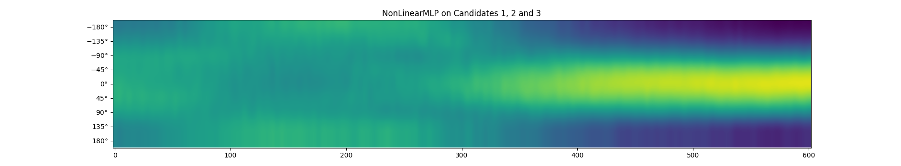

# Tracking Covert Spatial Attention using Linear and Non Linear Perceptrons

## Basic Overview

Covert Visual attention can be tracked by alpha-band activity. [[1]](#1) Inverted Encoding Models have been used before to track spatial attention. <br>
We use Non Linear Perceptrons to do the same.

### Channel Tuning Functions

For the experimental data presented in [[1]](#1), we have 8 spatial locations called channels. <br> 
To each spatial location we associate a tuning function. The channel tuning function is <br>

$$
\begin{aligned}
R = sin^7(0.5(\theta - \theta_c + \pi))
\end{aligned}
$$

where $\theta_c$ is the channel for which we are considering the TF. <br>

<p align="center">
    
    
    <br>
</p>

### Inverted Encoding Models (Forward Computation + Inversion of Weight Matrix) [[1]](#1)

$B_1 \rightarrow$ Train EEG Matrix ($m$ electrodes $\times$ $n_1$ measurements) <br>
$B_2 \rightarrow$ Test EEG Matrix ($m$ electrodes $\times$ $n_2$ measurements) <br>
$W \rightarrow$ Weight Matrix ($m$ electrodes × $k$ channels) <br>
$C_1 \rightarrow$ Channel Responses based on CTFs ($k$ channels $\times$ $n_1$ measurements) <br>
$C_2 \rightarrow$ Predicted Channel Responses ($k$ channels $\times$ $n_2$ measurements) <br>

$$
\begin{aligned}
B_1 = WC_1 \\
\widehat{W} = B_1C_1^T(C_1C_1^T)^{-1} \\
\widehat{C_2} = (\widehat{W}^T\widehat{W})^{-1}\widehat{W}^TB_2
\end{aligned}
$$

### Non Linear Perceptrons (Forward Computation + Back Propogation to compute weights)

<br>
Directly compute mapping from EEG matrix to channel responses

<br>

## Dependencies
```
python>=3.7
PyTorch
numpy
seaborn, matplotlib
Matlab R2023b + Signal Processing Toolbox
```

## Downloading EEG and Behaviour Data

https://archive.org/details/osf-registrations-tuu4m-v1

## How to use

To visualize spatial attention as heat maps
```
python run.py --model LinearPerceptron --numIterations 10 --startTime 0 --endTime 600 --verbose False --saveHeatMap "./trial.jpeg"
```

<p align="center">
    
</p>

## References
<a id="1">[1]</a> 
Foster et al. (2017). 
Alpha-Band Oscillations Enable Spatially and Temporally Resolved Tracking of Covert Spatial Attention
